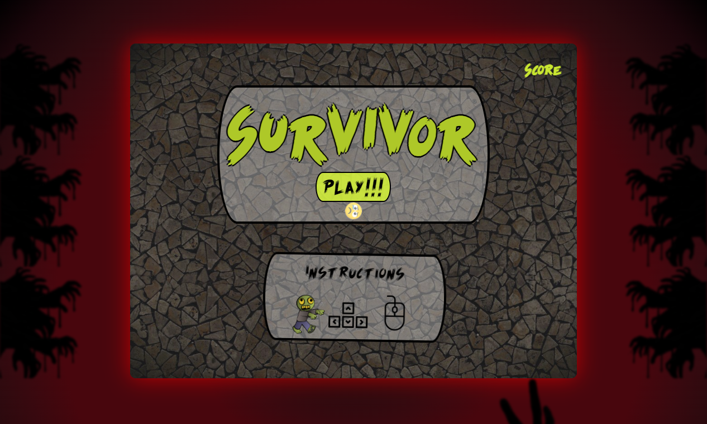
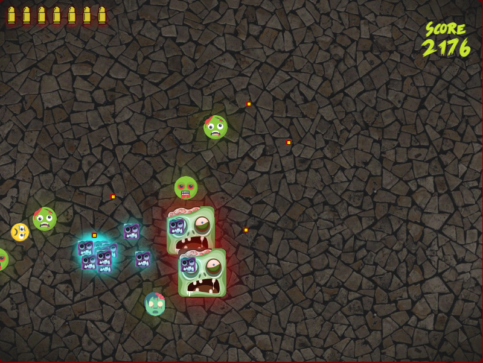

# SURVIVOR

## Description

As the first project for my Ironhack bootcamp, Survivor is an arcade game created with JavaScript, HTML, and CSS.

## How to play

The goal of the game is to survive the waves of zombies that are continually coming at you.

The arrow keys let you to travel in 8 different directions, and the mouse is used to shoot bullets.

## Demo

[Link to the Demo](https://jogopin.github.io/Survivor-game/)

## To-Do

- Make a local storage to show the highest score.
- Include items in the game that alter both the player's and the zombies' behavior
- Improve collision detection between the zombies